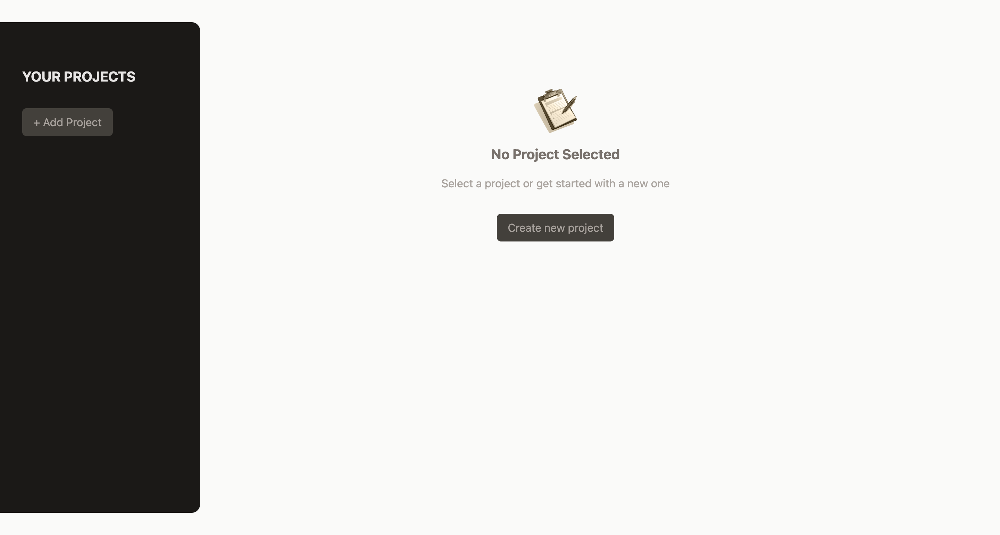

# 📝 ProjectManagementApp

A simple React-based project management app that allows users to create, select, and delete projects, as well as add and remove tasks for each project.

## 🚀 Features
- Create new projects with a title, description, and due date. 
- Select and view project details. 
- Delete projects when no longer needed. 
- Add and remove tasks within a selected project. 
- Dynamic UI updates using React state management.

## 🛠️ Technologies Used
  • React (with hooks for state management)
  • Tailwind CSS for styling

## 🏗️ How to Run the Project

1. Clone the repository:
   ```bash
   git clone https://github.com/halynabondar/ProjectManagementApp.git
   ```
   
2. 	Navigate to the project directory:
   ```bash
   cd ProjectManagementApp
   ```

3. Install dependencies:
   ```bash
   npm install
   ```

4. Start the project:
   ```bash
   npm run dev
   ```

## Screenshots

